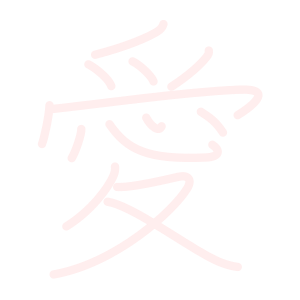
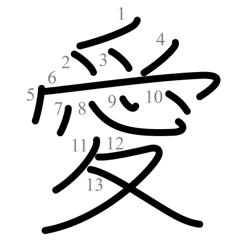

# Kanji PNG & GIF Generator - Animated Stroke Order Images

[](https://creativecommons.org/licenses/by-sa/3.0/)

A powerful Node.js utility to generate high-quality **Kanji PNG** images and **Kanji GIF** animations. 

Create custom, high-resolution Japanese character images and **stroke order animations** for your projects, apps, or study materials.

> ⚡️ **Live Demo:** This library powers the real-time stroke order animations for the **[Jepang.org Kanji Dictionary](https://jepang.org/kanji/)**. See it running in production!

**Repository:** [github.com/sepTN/kanji-png-gif](https://github.com/sepTN/kanji-png-gif)

## Features

| **Standard Animation** | **Custom Colors** | **Transparent PNG** |
| :---: | :---: | :---: |
|  |  |  |
| *Smooth fixed/relative timing* | *Custom stroke & guide colors* | *High-res transparent backgrounds* |

*   **Kanji PNG Generator**: Create transparent, high-res static images of Kanji.
*   **Kanji GIF Generator**: Generate smooth, **animated stroke order GIFs**.
*   **Fully Customizable**: Control output resolution, background color, and format.
*   **Smart Timing**: Choose between fixed duration or **relative timing** (where complex Kanji take longer to write).
*   **Open Graph Compatible**: Automatically generates images optimized for social media cards.

## Prerequisites

*   **Node.js**: v14 or higher (most modern versions work).

### Key Dependencies (installed via npm)
*   **[sharp](https://sharp.pixelplumbing.com/)**: High-performance image processing.
*   **[cheerio](https://cheerio.js.org/)**: Fast, flexible, and lean implementation of core jQuery for SVG parsing.
*   **[gif-encoder-2](https://github.com/inayatkh/gif-encoder-2)**: Animated GIF generation.
*   **[svg-path-properties](https://github.com/rveciana/svg-path-properties)**: Pure Javascript alternative to get path length (for stroke animation).

## Installation

1.  **Clone the repository**:
    ```bash
    git clone https://github.com/sepTN/kanji-png-gif.git
    cd kanji-png-gif
    ```

2.  **Install dependencies**:
    ```bash
    npm install
    ```

## Usage

You can generate **Kanji PNGs** and **Kanji GIFs** using the simple CLI.

The repository already includes pre-generated assets in `kanji_png/`, `kanji_png_og/`, and `kanji_gif/`.

You can use the `generate.js` script to create **custom** assets with your preferred settings.

### Custom Generation Examples

**1. Animated GIF with Relative Timing**
Good for study apps. Complex characters take longer to write than simple ones.
```bash
node generate.js --file 04e00.svg --format gif --width 300 --timing relative
```

**2. High-Resolution PNG for Print**
Generate a large, crisp image (2000x2000).
```bash
node generate.js --file 09b31.svg --format png --width 2000
```

**3. Colored Backgrounds**
Generate a PNG with a specific background color (e.g., for social media headers).
```bash
node generate.js --file 04e00.svg --format png --width 500 --bg "#ffcc00"
```

**4. Fast Animation (Fixed 1s Duration)**
Force the animation to complete in 1 second, regardless of stroke count.
**5. Custom Colors**
Red strokes with a blue guide.
```bash
node generate.js --file 04e00.svg --format gif --color "#ff0000" --guide "#0000ff"
```

### Command Line Options

| Option | Description | Default |
| :--- | :--- | :--- |
| `--file <filename>` | Process a single Kanji file (e.g., `04e00.svg`) | Process all |
| `--format <type>` | Output format: `png` or `gif` | All 3 default types |
| `--width <px>` | Output width | `1024` (PNG), `200` (GIF) |
| `--height <px>` | Output height (defaults to width) | - |
| `--out <dir>` | Output directory | `kanji_custom` |
| `--bg <color>` | Background color (e.g., `white`, `transparent`, `#ff0000`) | `white` |
| `--color <hex>` | Main stroke color (e.g., `#ff0000`) | `#000000` (Black) |
| `--guide <hex>` | Guide color (e.g., `#cccccc` or `none`) | `#dddddd` (Grey) |
| `--duration <ms>` | Animation duration (GIF only) | `2000` |
| `--fps <num>` | Frames per second (GIF only) | `20` |
| `--timing <mode>` | `fixed` (constant time) or `relative` (scales with strokes) | `fixed` |

## Attribution & License

This project is licensed under the **Creative Commons Attribution-Share Alike 3.0 (CC BY-SA 3.0)** license.

The images and animations are derivative works created by **Septian Ganendra S. K.** (Lead Maintainer at [Jepang.org](https://jepang.org)), based on data from:
*   **KanjiVG** by Ulrich Apel (http://kanjivg.tagaini.net). Copyright (C) 2009-2023 Ulrich Apel.
*   **AniKanjiVG** by Paul C. Sommerhoff (https://bitbucket.org/sommerhoff/anikanjivg/).

If you use these images or animations in your own work, you **must**:
1.  **Attribute the authors**: Septian Ganendra S. K., KanjiVG, and AniKanjiVG.
2.  **Release your derivative work under the same license** (CC BY-SA 3.0 or compatible).

### Attribution Example
> "Kanji images and animations by Septian Ganendra S. K. (Jepang.org), based on data from KanjiVG (Ulrich Apel) and AniKanjiVG (Paul C. Sommerhoff). Licensed under CC BY-SA 3.0."

## License Text
See the [LICENSE](LICENSE) file for the full legal text.
